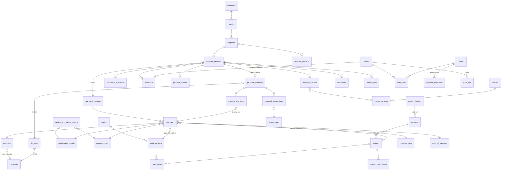

# Adrenalin Deal Desk — Database Schema (design v1)

Status: **proposal for review** — nothing here has been created in Neon yet.
Sources: FSD (29 Sep 2026), design walkthrough (25 Sep), review meeting (30 Sep), PEPM / Platform+Subscription
calculation sheets, deployment × pricing-model combinations sheet, prototype v22, pricing-model PDF.

## 0. How this will be built (so schema and code never drift)

- **SQLAlchemy models are the source of truth. Alembic migrations create the tables.** We do not hand-write DDL in the Neon
  SQL Editor. If you want to read the SQL, run `alembic upgrade head --sql` and it prints exactly what would run.
- Built in **waves** (section 4). One migration per wave, verified before the next.
- Naming: tables `snake_case` plural; PK `id bigint generated always as identity`; business keys in a `code` column.

### Conventions used by every table
 
| Topic | Rule |
|---|---|
| Money | `numeric(18,4)`; never `float`. Rounding happens once, at presentation (FSD §8). |
| Percent | `numeric(7,4)` with `CHECK (x >= 0 AND x <= 100)`. |
| FX rate | `numeric(18,8)`, `CHECK (rate > 0)`. |
| Timestamps | `created_at`, `updated_at` as `timestamptz default now()`. |
| Status fields | `text` + `CHECK (status IN (...))` (not PG enums — easier to migrate). |
| Effective dating | Masters carry `valid_from date NOT NULL`, `valid_to date NULL`, `CHECK (valid_to IS NULL OR valid_to > valid_from)`, `status`. |
| Deleting | **Never delete master rows**; set `status='retired'`. All FKs are `ON DELETE RESTRICT`, so a retired country still resolves on old proposals (FR-022). |
| Concurrency | Editable proposal tables carry `row_version int` for optimistic locking (FSD §14). |

## 1. Your 32-table list vs. what the specs require

All 32 of your tables are kept. The specs also need **10 more** (42 total), and one of yours changes meaning.

| Added table | Why it is required (source) |
|---|---|
| `customers` | HubSpot company: name, industry, employee count. FSD §12 diagram has "Customer" as its own entity |
| `deals` | HubSpot deal: stage, amount, close date. Sync is idempotent on `hubspot_deal_id` (FSD §11), so it needs a unique row |
| `units_of_measure` | New master: Employee / Candidate / Transaction / Flat, one of the 6 rate-card dimensions (FSD §6, FR-082) |
| `deployment_pricing_options` | Which pricing models are allowed per deployment model — drives the dropdown filter (combinations sheet) |
| `rate_card_versions` | Rate cards are versioned; a proposal locks one version (FSD §6, FR-027) |
| `pack_versions` | Packs are versioned and locked once issued (FSD §6, FR-055) |
| `product_descriptions` | Approved scope-of-work text per product/feature (FR-046) |
| `proposal_service_lines` | Services = role × effort × rate; not a product line (FSD §7, §8) |
| `proposal_contacts` | Addressee / acceptance page contacts from HubSpot (FSD §11) |
| `proposal_clauses` | Stamps the exact clause versions into a proposal version (FSD §10, traceability) |

Changed meaning: `pack_items` hangs off **`pack_versions`**, not `packs`; `rate_cards` rows hang off **`rate_card_versions`**.
The FSD's "three-level hierarchy" maps to your tables as: `product_families` (L1) → `products` (L2 module) → `features` (L3).

Deliberately **not** created: a `permissions` table. The FSD role matrix has 6 fixed roles; enforce it in Python
(one dict, unit-tested). Add a table later only if Admin must edit permissions in the UI.

## 2. ER diagram (core tables)

**How to read it:** masters (top) feed the rate card; a proposal is *versioned*; each version has one block per country; each
block has product lines (each pointing to exactly one rate-card row) and service lines; every recalculation writes an
immutable snapshot; approvals, content, clauses and documents hang off the **version**, never the proposal.

## 3. Tables

Legend: **PK**, **FK→**, `U` unique, `NN` not null, `CK` check.

### 3.1 Masters (Wave 1) — maintained by Admin / Pricing Desk

**currencies** — `code` char(3) U NN (ISO 4217), `name` NN, `symbol`, `decimal_places` smallint NN default 2, `status`.

**countries** — `iso_code` char(2) U NN, `name` NN, `region` NN (e.g. APAC / Middle East / India — *list to be confirmed*),
`currency_id` FK→currencies NN, `price_multiplier` numeric(10,6) NN default 1 CK>0, `status`, `valid_from`, `valid_to`.
(The FSD also lists a country "day rate"; that lives in `service_rates` so there is one source — see 3.4.)

**fx_rates** — `from_currency_id`, `to_currency_id` FK→currencies NN, `rate` numeric(18,8) NN, `rate_source` text,
`effective_date` date NN, `created_by`. U(`from_currency_id`,`to_currency_id`,`effective_date`). CK(from ≠ to).
Index on (from, to, effective_date DESC) for "latest rate" lookup. Rows are never updated — insert a new date.

**deployment_models** — `code` U (`shared_cloud`,`private_cloud`,`on_premise`), `name`, `description`,
`cost_basis_flag` bool, `status`.

**pricing_models** — `code` U (`pepm`,`platform_subscription`,`license_pepm`, …), `name`, `description`,
`has_fixed_component` bool, `has_unit_component` bool, `fixed_fee_basis` text CK IN (`annual`,`one_time`) NULL,
`uom_locked_id` FK→units_of_measure NULL (PEPM is always "Active Employees (with ESS)"), `status`.
The `*_component` flags tell the engine which rate-card columns must be filled for that model.

**units_of_measure** — `code` U (`employee`,`candidate`,`transaction`,`flat`), `name`, `conversion_rule` text, `status`.

**deployment_pricing_options** — `deployment_model_id`, `pricing_model_id` FK NN. PK(both). Seed from the combinations sheet:
shared cloud → PEPM, Platform+Subscription; private cloud → PEPM, Platform+Subscription; on-premise → licence fee + (AMC *or* PEPM — **open question Q2**).

**customer_tiers** — `name` U, `employee_min` int NN, `employee_max` int NULL (open-ended top tier), `default_multiplier`
numeric(10,6), `status`. CK(`employee_max IS NULL OR employee_max >= employee_min`). Non-overlapping bands enforced by an
exclusion constraint (`btree_gist`) or a service check — decide in Wave 1.

**contract_terms** — `term_months` int NN CK>0, `escalation_pct_per_renewal_year` numeric(7,4) NN default 0, `status`. U(`term_months`).

### 3.2 Catalogue & packs (Wave 2)

**product_families** (L1) — `code` U, `name` NN, `sort_order`, `status`.
**products** (L2 module) — `product_family_id` FK NN, `code` U, `name`, `status`. U(`product_family_id`,`name`).
**features** (L3) — `product_id` FK NN, `code` U (auto-generated), `name`, `classification` CK IN (`native`,`ai_enabled`,`partner`),
`partner_name` NULL (required when partner — CK), `status`. U(`product_id`,`name`).
**product_descriptions** — `feature_id` FK NN, `language` default `en`, `scope_text` NN, `feature_narrative`, `version_no`,
`valid_from`, `valid_to`, `status`. U(`feature_id`,`language`,`version_no`). Scope-of-work section reads only this table.

**packs** — `code` U, `name`, `variant` CK IN (`standard`,`premium`), `product_family_id` FK NULL (primary family; packs may span families),
`status`.
**pack_versions** — `pack_id` FK NN, `version_no` int NN, `status` CK IN (`draft`,`active`,`locked`,`superseded`),
`locked_at`, `list_price_ref`. U(`pack_id`,`version_no`). A trigger rejects UPDATE/DELETE on a `locked` version and on its items (FR-055).
**pack_items** — `pack_version_id` FK NN, `feature_id` FK NN. PK(both). Index on `feature_id` (reverse lookup for "is this in the pack").

Pack recommendation (FSD §7) is a **service-layer** calculation, not a table: `score(P) = |S ∩ P| / |S ∪ P|` (Jaccard
similarity; S = CRM-selected products, P = products in the pack). Ties → lower list price; top score < 0.4 → no recommendation.

### 3.3 Rate card (Wave 3)

**rate_card_versions** — `version_no` U, `name`, `status` CK IN (`draft`,`active`,`retired`), `valid_from`, `valid_to`,
`created_by`, `activated_by`, `activated_at`. Only `draft` versions are editable.

**rate_cards** — the six lookup dimensions plus the rate components:

| Column | Notes |
|---|---|
| `rate_card_version_id` FK NN | |
| `country_id`, `deployment_model_id`, `pricing_model_id`, `tier_id`, `uom_id` FK NN | 5 of the 6 dimensions |
| `pack_version_id` FK NULL, `feature_id` FK NULL | 6th dimension: `CK (num_nonnulls(pack_version_id, feature_id) = 1)` |
| `currency_id` FK NN | must equal the country's currency (service check) |
| `fixed_fee` numeric(18,4) NULL | platform fee / licence fee |
| `unit_rate` numeric(18,4) NULL | per unit per month (PEPM or subscription/consumption) |
| `floor_price` numeric(18,4) NULL | |
| `cost_fixed`, `cost_unit` numeric(18,4) NULL | cost rates for gross margin |
| `CK` | `fixed_fee IS NOT NULL OR unit_rate IS NOT NULL`, all amounts ≥ 0 |

**Determinism (FR-082):** two *partial unique indexes* guarantee "exactly one row":
`U(version, country, deployment, pricing_model, tier, uom, pack_version_id) WHERE pack_version_id IS NOT NULL` and the same with
`feature_id WHERE feature_id IS NOT NULL`. Zero rows → the service raises a named validation error; duplicates cannot exist.

**service_rates** — `role_name` NN, `country_id` FK NN, `hourly_rate`, `hours_per_day` numeric(5,2) NN default 8, `daily_rate`
(NULL → computed hourly × hours), `cost_rate`, `currency_id`, `valid_from`, `valid_to`, `status`. U(`role_name`,`country_id`,`valid_from`).

### 3.4 Users & governance (Wave 4)

**roles** — `code` U (`admin`,`pricing_desk`,`presales`,`sales_lead`,`business_head`,`cfo`), `name`.
**users** — `email` NN (unique on `lower(email)`), `full_name`, `password_hash` NN (argon2/bcrypt, never plain), `is_active`,
`region` NULL (Business Head scope), `hubspot_owner_id` NULL, `last_login_at`.
**user_roles** — `user_id`, `role_id` PK(both), `granted_by`, `granted_at`. Changes are audited.

**approval_thresholds** — persisted Admin-owned master (FR-031):
`threshold_type` CK IN (`gm_floor`,`line_discount`,`overall_discount`,`service_discount`), `value_pct` numeric(7,4) NN,
`approver_role_id` FK→roles NN, `escalation_role_id` FK→roles NULL, `timeout_hours` int, `region` NULL, `valid_from`, `valid_to`, `status`.
**No values are seeded** — see Q3.

**audit_logs** — append-only: `occurred_at` timestamptz NN, `actor_user_id` FK NULL (system actions), `action` NN,
`entity_type` NN, `entity_id` NN, `before` jsonb, `after` jsonb, `request_id`, `ip`. Indexes: (`entity_type`,`entity_id`),
(`occurred_at`). A trigger raises on UPDATE/DELETE; the app DB role gets INSERT/SELECT only. Retention 7 years (FSD §14); partition by month later.

### 3.5 Proposals (Wave 5) — the heart of the system

**customers** — `hubspot_company_id` U NN, `name` NN, `domain`, `industry`, `employee_count` int, `last_synced_at`.
**deals** — `hubspot_deal_id` U NN (idempotent sync key), `customer_id` FK NN, `deal_name`, `deal_stage` NN, `amount` numeric(18,4),
`close_date`, `last_synced_at`. The P3 gate (FR-013) is a service check on `deal_stage`; the proposal-creation endpoint refuses earlier stages.

**proposals** — `proposal_number` U NN, `deal_id` FK NN (a deal may have several proposals), `reporting_currency_id` FK NN,
`owner_user_id` FK NN, `region`, `is_locked` bool (deal regressed below P3 → read-only, never deleted),
`current_version_id` FK NULL (deferred), `created_at`, `updated_at`.

**proposal_contacts** — `proposal_id` FK NN, `first_name`, `last_name`, `job_title`, `email`, `hubspot_contact_id`, `is_primary` bool.

**proposal_versions** — the unit of record: `proposal_id` FK NN, `version_no` NN, U(both),
`status` CK IN (`draft`,`pending_confirmation`,`pending_approval`,`approved`,`in_review`,`issued`,`rejected`,`superseded`),
`rate_card_version_id` FK NN **(locked at creation)**, `validity_date`, `created_by`, `confirmed_by`, `issued_at`,
`row_version` int NN. Re-pricing against newer masters = a *new* version row.

**proposal_countries** (country block) — `proposal_version_id` FK NN, `country_id` FK NN, U(both), `deployment_model_id`, `pricing_model_id`,
`tier_id`, `contract_term_id`, `headcount` int NN CK>0, `local_currency_id`, `fx_rate_id` FK→fx_rates NN **(locked)**,
service-level fields as needed. FK (`deployment_model_id`,`pricing_model_id`) → `deployment_pricing_options` (invalid combos impossible).

**proposal_line_items** — `proposal_country_id` FK NN, `pack_version_id` FK NULL, `feature_id` FK NULL
(`CK num_nonnulls(...)=1`), `rate_card_id` FK NN **(exactly one — FR-082)**, `quantity` numeric(18,4) NN CK>0,
`line_discount_pct` numeric(7,4) NN default 0, `is_from_pack` bool, `sort_order`. U(`proposal_country_id`,`pack_version_id`),
U(`proposal_country_id`,`feature_id`) — a product can never appear twice (no double-charging, FR-067). *Amounts are not stored here*; they live in the snapshot.

**proposal_service_lines** — `proposal_country_id` FK NN, `service_rate_id` FK NN, `description` NN, `effort_days` numeric(10,2) NN CK>0,
`sort_order`. (Per FSD, service discount is one overall % per country block / product — stored on `proposal_countries.service_discount_pct`.)

**calculation_snapshots** — immutable record of one calculation run: `proposal_version_id` FK NN, `seq` int NN U(version,seq),
`is_current` bool (partial unique index: one current per version), `engine_version` text NN, `input_hash` text NN,
`reporting_currency_id`, headline columns (`licence_fee`, `subscription_fee`, `service_fee`, `discount_value`, `net_value`, `fcv`,
`gross_margin_pct`) numeric(18,4), `result` jsonb NN (per-country, per-line detail), `formula_trace` jsonb NN (FR-097), `created_by`, `created_at`.
Never updated; a trigger forbids UPDATE/DELETE. This is what makes an issued proposal reproducible years later.

**proposal_content** — narrative/team sections: `proposal_version_id` FK NN, `section_key` NN, `owner_type` CK IN (`standard`,`ai`,`system`,`team`),
`body` text, `is_editable` bool, `last_edited_by`, `row_version` int NN. U(`proposal_version_id`,`section_key`). The 13 sections in FSD §10 become seed
rows of `section_key`. Code refuses writes to `system` sections (FR-135).

**approvals** — `proposal_version_id` FK NN, `approval_type` CK IN (`discount_margin`,`finance_gm`,`exception`,`document_review`),
`requested_by` FK NN, `justification` text NN, `trigger_reasons` jsonb, `required_role_id` FK NN, `approver_user_id` FK NULL,
`decision` CK IN (`pending`,`approved`,`rejected`,`delegated`,`expired`), `comments`, `decided_at`, `expires_at`, `delegated_from_id`.
An approval is invalidated (not deleted) when price/quantity/term/discount changes.

### 3.6 Clauses, documents, CRM (Wave 6)

**clauses** — `code` U, `category`, `jurisdiction`, `status`.
**clause_versions** — `clause_id` FK NN, `version_no` NN U(both), `body` text NN, `effective_from` NN, `effective_to`, `status`. Never edited once active.
**proposal_clauses** — `proposal_version_id`, `clause_version_id` PK(both), `sort_order`.
**documents** — `proposal_version_id` FK NN, `kind` CK IN (`docx`,`pdf`), `storage_key` NN (file lives in object storage, **not** in the DB),
`sha256` NN, `generated_by`, `generated_at`, `is_superseded` bool.
**crm_field_mappings** — `crm_object`, `crm_property`, `maps_to_table`, `maps_to_column`, `is_required`, `direction` CK IN (`inbound`,`outbound`), `status`. U(`crm_object`,`crm_property`,`direction`).
**crm_sync_logs** — `direction`, `endpoint`, `request_id` NN, `http_status`, `latency_ms`, `proposal_id` NULL, `hubspot_deal_id`, `attempt`, `error_summary`
(**no PII, no tokens**), `created_at`.
**publish_jobs** — `proposal_version_id` FK NN, `document_id` FK NN, `status` CK IN (`queued`,`running`,`succeeded`,`failed`),
`attempts` int NN default 0 CK≤5, `next_attempt_at`, `hubspot_quote_id`, `last_error`. Queued when the CRM is unreachable (FSD §11).

## 4. Build order (migrations)

| Wave | Tables | Why this order |
|---|---|---|
| 1 | currencies, countries, fx_rates, units_of_measure, deployment_models, pricing_models, deployment_pricing_options, customer_tiers, contract_terms | no dependencies; covers your original 7 + the rest of the masters |
| 2 | product_families, products, features, product_descriptions, packs, pack_versions, pack_items | needs only itself |
| 3 | rate_card_versions, rate_cards, service_rates | needs waves 1–2 |
| 4 | roles, users, user_roles, approval_thresholds, audit_logs | needed before any write endpoint is protected |
| 5 | customers, deals, proposals, proposal_contacts, proposal_versions, proposal_countries, proposal_line_items, proposal_service_lines, calculation_snapshots, proposal_content, approvals | needs 1–4 |
| 6 | clauses, clause_versions, proposal_clauses, documents, crm_field_mappings, crm_sync_logs, publish_jobs | last; depends on the proposal model |

## 5. Open business questions (the schema deliberately does not guess)

- **Q1 Naming** — the meeting said "use *subscription*, not *consumption*". Column names above use `unit_rate`; pricing-model name in UI = "Platform + Subscription".
- **Q2 On-premise** — combinations sheet says *Licence fee + **AMC***; prototype and FSD say *Licence fee + **PEPM***. Which is correct? AMC (annual maintenance) is a % of licence, so it needs a different component (`amc_pct`).
- **Q3 Thresholds** — the prototype hard-codes GM 30 %, line discount 15 %, overall discount 20 %, but the FSD lists threshold values, approver per band and escalation path as **still open**. Need the real values.
- **Q4 Tier bands** — the employee-count lower/upper bound of each tier.
- ~~Q5 Pack-recommendation formula~~ — **resolved**, read from the FSD images (Jaccard, see 3.2).
- **Q6 Licence fee treatment** — one-time (prototype) vs. recurring? And is platform fee pro-rated for terms that are not whole years?
  (FSD: `A = F + R·Q·M` per year; prototype: platform × term/12. They agree for whole-year terms only.)
- **Q7 Engine formulas (from the FSD images, for the pricing wave)** — `A = R·Q·M` (PEPM) or `F + R·Q·M` (platform+subscription);
  services `S = Σ effort × day-rate(role, country)`; `V = A·(1−line disc)·(1−overall disc)`;
  `FCV = Σ_countries (1/X)·[ Σ_years (1+e)^(y−1)·ΣV  +  S ]`; `GM = (V − cost) / V`.
  To confirm: (a) services are **not** escalated and the services discount is separate; (b) `X` direction — we will store FX as
  "1 unit of *from* = `rate` units of *to*" and the engine multiplies, so the formula's `1/X` becomes a plain multiply.
- **Q8 Regions** — fixed list (APAC, Middle East, India, …) or free text?
- **Q9 Proposal numbering / validity period / supersede policy** — listed as open in the FSD.
